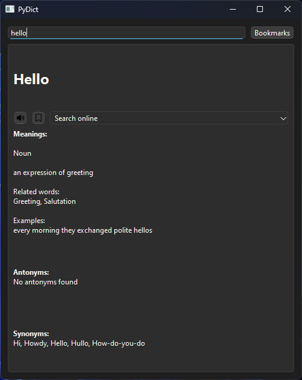

# PyDict

 \
A simple offline English dictionary written in Python using the PySide module

## Installation

### Windows

Make sure you installed the Python interpreter from the [website](https://www.python.org/) or [Microsoft Store](https://apps.microsoft.com/search?query=python&hl=en-US&gl=US). \
If installed from the website, make sure Python is in PATH.
Next, type these commands:

```sh
pip install pyside6 pyttsx3
git clone https://github.com/Ibrahimbag/dictionary.git
cd pydict
python3 pydict.py 
```

### Linux

```sh
sudo apt install -y python3 python3-pip libxcb-cursor-dev espeak-ng libespeak1 alsa-utils git
pip install pyside6 pyttsx3
git clone https://github.com/Ibrahimbag/dictionary.git
cd pydict
python3 pydict.py
```

## Credits

Dictionary dataset is taken from here: <https://github.com/nightblade9/simple-english-dictionary/tree/main> \
text to speech icon: <https://www.iconfinder.com/icons/9035030/volume_medium_icon> \
bookmark icon: <https://www.iconfinder.com/icons/2849790/bookmark_book_multimedia_tab_media_icon>
